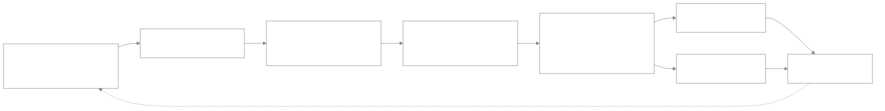

<div align="center">

## Automated Gimbal System for Speaker-centric recording and Surveillance


**An AI-powered robotic gimbal that automatically tracks a speaker in real time, keeping them centered for smooth, hands-free recording.**


</div>

---

## Why This Project?

> Traditional camera setups often require manual operation, making it difficult to continuously keep a speaker or subject within the camera frame during lectures, events, and surveillance. Existing automated tracking systems can also be expensive and complex to deploy. This project addresses this challenge by developing a low-cost AI-powered robotic gimbal system that uses computer vision to detect and track a speaker in real time, automatically controlling pan and tilt movement to keep the subject centered while recording.

The system combines a **Raspberry Pi 4**, an **IP webcam**, a **deep neural network (DNN) face detector**, and a **dual stepper motor pan-tilt mechanism**. It runs entirely on the edge, no cloud, no subscription, no external compute. Just plug in, power up, and the gimbal handles the rest. Whether you are recording a lecture, streaming a presentation, or setting up an unattended surveillance node, the gimbal keeps the subject locked in frame without any human intervention.

---

## 🏗️ How It Works



The pipeline is a closed feedback loop. Each frame captured from the IP webcam is analyzed by the DNN face detector, which returns the coordinates of the speaker's face. The system then compares the face center against the frame center to compute a horizontal and vertical offset. These offsets pass through an exponential smoothing filter to eliminate jitter, and are then converted into precise step and direction commands for the pan and tilt stepper motors. The motors adjust the camera's orientation, and the loop repeats, keeping the speaker locked at the center of the frame in real time.

---

## 🔧 System Overview

| Layer | Component | Role |
|---|---|---|
| **Input** | IP Webcam (ESP32-CAM / phone stream) | Streams MJPEG video over HTTP |
| **Compute** | Raspberry Pi 4 Model B | Runs detection, tracking logic, and motor control |
| **Vision** | OpenCV DNN (ResNet-10 SSD) | Detects faces in each frame |
| **Control** | GPIO + A4988/DRV8825 drivers | Converts logic into stepper pulses |
| **Actuation** | 2× NEMA 17 stepper motors | Pan (horizontal) and tilt (vertical) motion |
| **Structure** | 3D-printed pan-tilt bracket | Mechanical support and axis alignment |
| **Power** | 12V 2A (motors) + 5V 3A (Pi) | Isolated supplies for noise-free operation |

---

## 3-D Printed Parts and Assembly

The mechanical frame of the gimbal is fully 3D-printed, making it easy to replicate, modify, and repair. All parts were designed in **AutoCAD** and printed.


---

## Circuit Diagram

The electronics are built around the Raspberry Pi's GPIO header. Each stepper motor is driven by a dedicated A4988 or DRV8825 driver module, which handles the high-current coil switching while the Pi only provides step, direction, and enable signals.


```
```

### Complete Data Flow

1. **Capture** — The IP webcam streams MJPEG frames over HTTP to the Raspberry Pi.
2. **Preprocess** — Each frame is resized to 640 px width to reduce inference time.
3. **Detect** — The ResNet-10 SSD model detects all faces and returns bounding boxes with confidence scores.
4. **Select** — The highest-confidence face is chosen as the tracking target.
5. **Calculate Offset** — The face center is compared against the frame center to compute Δx and Δy.
6. **Smooth** — An exponential filter (α = 0.3) removes jitter and prevents motor oscillation.
7. **Dead Zone Check** — If the offset is below 30 px, no movement is triggered.
8. **Control** — Step count and delay are computed proportionally to the offset magnitude.
9. **Actuate** — Pan and tilt motors move asynchronously in background threads.
10. **Repeat** — The loop runs continuously, keeping the speaker centered.

```


